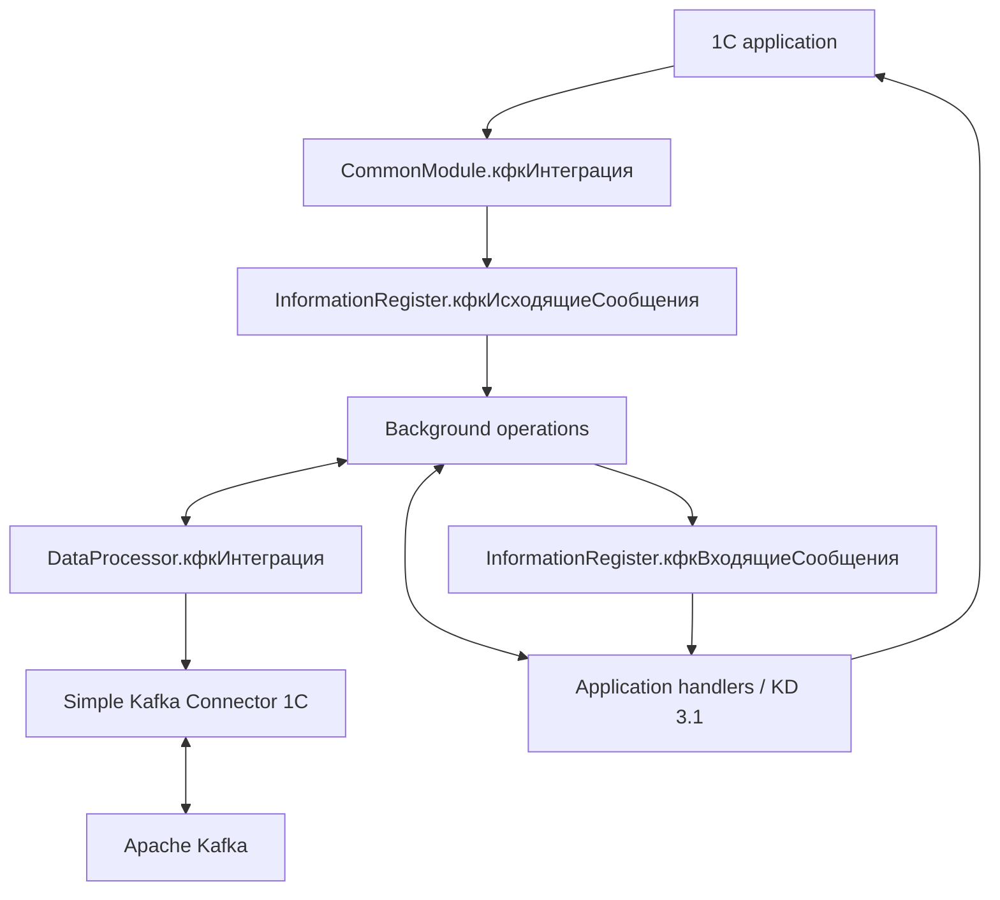

# Kafka Adapter Architecture

## Summary

- The adapter is an embeddable 1C extension/library.
- Persistent information registers decouple application writes from Kafka work.
- `кфкИнтеграция` and `кфкИнтеграцияКлиент` are public facades.
- Background operations split serialization, send, receive, and deserialization.
- `DataProcessor.кфкИнтеграция` wraps the external Kafka component.
- Producer/consumer handlers are application extension points.
- Configuration metadata controls routing and execution without code changes.

## Context

## Architectural layers

| Layer | Main objects | Responsibility |
|---|---|---|
| Public facade | `кфкИнтеграция`, `кфкИнтеграцияКлиент` | Stable application entry points |
| Registration | event subscriptions, `кфкОбработкаСобытийСлужебный` | Select and enqueue changes |
| Persistence | outgoing/incoming/service registers | Durable work and operational state |
| Orchestration | `кфкФоновыеОперацииСлужебный` | Dispatch, parallel workers, cleanup, control |
| Transformation | handlers, `кфкОбменДаннымиXDTOСервер` | Serialize/deserialize business payloads |
| Transport | `DataProcessor.кфкИнтеграция` | Connector sessions and Kafka operations |
| Administration | `кфкПанельАдминистрирования` | Configuration, queues, diagnostics |

## Public API boundary

EDT verified fourteen exports in `кфкИнтеграция`, including:

- `Отключить`;
- `ПоместитьВОчередьИсходящих`;
- `КлючОбъекта`;
- `КлючЗаписиИсходящихСообщений`;
- `Отправить` and `Прочитать`;
- producer/consumer session closure;
- message and integration-result constructors.

The client module exports history and connected-command handlers. Internal
modules may expose BSL methods for platform callbacks but are not application
contracts.

## Operational properties

- Queue state survives worker and process restarts.
- Parallelism is bounded by producer/consumer task settings.
- Failed transport sends are documented with a limited automatic retry.
- Application-processing failures require correction and explicit return to queue.
- Hash state supports idempotent send/processing decisions.
- A duplicate-control operation suppresses obsolete unsent outgoing versions.

## Change boundaries

Changes to public facade signatures, queue schema/status semantics, dispatch
partitioning, connector behavior, or handler contracts require a specification
and normally an ADR. UI-only labels or internal refactoring may not.

