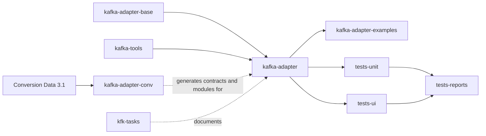

# Repository and Dependency Map

## Summary

- `kafka-adapter` is the product source and documentation repository.
- `kafka-adapter-base` is the 1C host used for development and testing.
- `kafka-adapter-examples` demonstrates API and conversion scenarios.
- `kafka-adapter-conv` extends Conversion Data 3.1 for arbitrary XDTO/AsyncAPI work.
- Unit and UI tests are separate repositories; reports are published separately.
- `kafka-tools` supplies local infrastructure and CI/release utilities.
- `kfk-tasks` owns Issues, Memory Bank, ADRs, SDD, and its MCP service.

## Local map

All paths are relative to `KAFKA_PROJECTS_ROOT`.

| Repository | Relative path | Responsibility |
|---|---|---|
| `kafka-adapter` | `adapter/adapter` | Product extension/library and MkDocs |
| `kafka-adapter-base` | `adapter/base` | BSP-based host configuration |
| `kafka-adapter-examples` | `adapter/examples` | Development-only example extension |
| `kafka-adapter-conv` | `conversion/KFK` | Conversion Data customization extension |
| Conversion Data 3.1 | `conversion/КД` | Local base configuration; not a project repository here |
| `kfk-tasks` | `tasks` | Knowledge, SDD, ADR, MCP, task tracking |
| `kafka-adapter-tests-reports` | `tests/reports` | Generated Allure/Sonar publication |
| `kafka-adapter-tests-ui` | `tests/ui` | Vanessa Automation features |
| `kafka-adapter-tests-unit` | `tests/unit/unit` | YAxUnit extension and assembly scripts |
| `kafka-tools` | `tools` | Kafka/logging/DB/Sonar/XDTO tooling |

## Dependency direction

Arrows indicate build/test/use relationships, not package-manager dependencies.

## Important qualifications

- EDT exposes projects `adapter`, `base`, and `examples` through `kfk_edt`.
- EDT exposes projects `KFK` and `КД` through `conv_edt`.
- `KFK` contains adopted core objects and its own `кфк*` objects.
- The checked-out unit-test repository is nested at `tests/unit/unit`; sibling
  directories are generated/local EDT workspace material and are not canonical.
- `conversion/КД` has no Git repository in the current workspace.

## Repository details

Follow the repository links in the [Memory Bank index](README.md#repository-documents).

